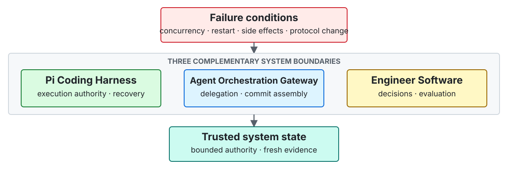

# KirschQAQ

**Graduate student at USTC building execution and control infrastructure for AI coding agents.**

Prompts determine what an agent attempts; runtime infrastructure determines what the system can
trust after concurrent workers, process restarts, partial side effects, or protocol changes. I build
that infrastructure in my own systems and test the same design principles through upstream work
across Pi, Codex, MCP/A2A, OpenHands, Microsoft Agent Framework, and LiteLLM.

> Design rule: agent output is a proposal. Authority comes from durable state, explicit scope, and
> fresh evidence.

[简体中文](README.zh-CN.md)

## Systems

<picture>
  <source media="(max-width: 600px)" srcset="assets/profile-systems-en-mobile.svg">
  
</picture>

### [Pi Coding Harness](https://github.com/KirschBluteX/pi-coding-harness)

**A transaction and recovery layer for Pi Coding Agent.**

I built PCH around a strict separation: models propose work; the runtime alone decides what becomes
durable. A small, passive TypeScript Bridge communicates with an on-demand Host over authenticated,
bounded RPC. SQLite WAL, immutable event chains, and content-addressed storage preserve the
Goal -> Route -> WorkCell -> Operation -> Evidence lifecycle across restarts.

A single-agent run works directly in the canonical workspace. Multi-agent runs place role-isolated
workers in credential-excluding scoped mirrors and treat every hash-bound PatchSet as an untrusted
proposal. Before serial integration can change the canonical workspace, PCH checks the lease,
fencing token, preimage, postimage, and a freshly executed oracle. After interruption, recovery
reconciles unknown side effects before authorizing exactly one next action.

**Core mechanisms:** TypeScript · authenticated HMAC RPC · SQLite WAL · immutable events · CAS ·
leases and fencing · fault injection

[Architecture](https://github.com/KirschBluteX/pi-coding-harness/blob/main/docs/ARCHITECTURE.md) ·
[Verification evidence](https://github.com/KirschBluteX/pi-coding-harness/actions/runs/31958661105)

### [Agent Orchestration Gateway](https://github.com/KirschBluteX/agent-orchestration-gateway)

**A deterministic admission, scheduling, and integration control plane for Codex native Agents.**

AOG compiles a closed, schema-validated delegation DAG into routes that the live host can actually
execute. Codex Hooks bind each prepared dispatch to durable wave, lifecycle, and receipt state
across spawn, reuse, retry, restart, and completion. Guarded plans receive an independently routed
final reviewer.

It admits cooperative writers only when their scopes are pairwise disjoint. They execute inside
managed Git worktrees or bounded workspace copies, then enter a journaled integration path with
staged backups, conflict detection, and explicit rollback. These controls sit around Codex native
Agents instead of introducing a second Agent runtime.

**Core mechanisms:** Python · Codex Hooks · typed delegation DAGs · capability-aware routing · Git
worktrees · durable receipts · journaled rollback

[Benchmark protocol](https://github.com/KirschBluteX/agent-orchestration-gateway/blob/main/docs/BENCHMARK.md)

### [Engineer Software](https://github.com/KirschBluteX/engineer-software)

**A runtime-neutral engineering decision layer for AI coding agents.**

Engineer Software keeps one canonical workflow source, exposes it as a Codex plugin, and projects it
into DeepSeek Harness's filesystem skill contract. Projection, loader, resource, and source-identity
validators turn cross-runtime drift into a failing check instead of a documentation problem.

Rather than forcing every task through a fixed pipeline, a deterministic router selects one
evidence-gated engineering mode. Routing fixtures cover activation, bypass, and legal transitions.
Paired behavior evaluations run baseline and treatment conditions in matched worktrees, preserve
raw events and patches, and report rubric scores, timing, and exact sign-test results without
turning a small pilot into a general performance claim.

**Core mechanisms:** Python · Codex plugins · DeepSeek Harness skills · generated projections ·
deterministic routing · paired behavior evaluation

[Evaluation design](https://github.com/KirschBluteX/engineer-software/blob/main/evals/README.md) ·
[Runtime compatibility](https://github.com/KirschBluteX/engineer-software/blob/main/docs/compatibility.md)

## Selected upstream engineering

### Accepted upstream

- **[MudBlazor #13622](https://github.com/MudBlazor/MudBlazor/pull/13622)** preserved the
  non-negative page-index invariant for empty tables and added regression coverage. **Merged.**

### Deeper implementations under review

**[Microsoft Agent Framework #7679](https://github.com/microsoft/agent-framework/pull/7679) -
deterministic parallel `Foreach`.** The implementation adds opt-in, bounded fan-out to declarative
.NET workflows while preserving sequential behavior by default. Each iteration runs as an isolated
sub-workflow, buffers state and events, and commits in source-index order. Failure or timeout cancels
peers and discards buffered commits. Forty focused parallel tests pass on each target framework; the
915-test unit suite passes on both `net10.0` and `net472`.

**[LiteLLM #37027](https://github.com/BerriAI/litellm/pull/37027) - bounding an OOM-prone admin
API.** I traced the failure to unbounded history reads across legacy spend-log query branches. The
change applies stable `take`/`skip` ordering everywhere, rejects invalid pagination before querying,
and preserves legacy list and summary contracts while making deprecation and pagination explicit.
The mapped endpoint suite passes 188 tests, and the current GitHub check suite is green.

**[MCP C# SDK #1816](https://github.com/modelcontextprotocol/csharp-sdk/pull/1816) - protocol
evolution without shared-state leakage.** A single typed response-emission boundary strips
unsupported fields for legacy clients, supplies defaults for current clients, and edits freshly
serialized nodes so shared result instances cannot leak state across protocol versions. Concurrent
compatibility warnings are deduplicated. The validated non-Docker scope covers 2,366 core and 617
ASP.NET Core tests.

<strong>More upstream engineering</strong>

- **MCP C# SDK:** [task-backed tool composition #1814](https://github.com/modelcontextprotocol/csharp-sdk/pull/1814)
  and [MCP Apps helper composition #1815](https://github.com/modelcontextprotocol/csharp-sdk/pull/1815).
- **A2A SDKs:** [subscriber backpressure in Go #414](https://github.com/a2aproject/a2a-go/pull/414),
  [wire-version propagation in JavaScript #659](https://github.com/a2aproject/a2a-js/pull/659), and
  [active-task snapshot consistency in Python #1189](https://github.com/a2aproject/a2a-python/pull/1189).
- **OpenHands:** [Windows browser discovery #4502](https://github.com/OpenHands/software-agent-sdk/pull/4502),
  [background delegation lifecycle #4503](https://github.com/OpenHands/software-agent-sdk/pull/4503),
  and [automation preflight validation #16614](https://github.com/OpenHands/OpenHands/pull/16614).
- [All authored pull requests](https://github.com/pulls?q=is%3Apr+author%3AKirschBluteX)

## Design and evaluation

- **Runtime authority:** the
  [PCH architecture](https://github.com/KirschBluteX/pi-coding-harness/blob/main/docs/ARCHITECTURE.md)
  documents process ownership, durable state, mutation authority, recovery precedence, and the
  serial integration boundary.
- **Orchestration experiments:** the
  [AOG benchmark protocol](https://github.com/KirschBluteX/agent-orchestration-gateway/blob/main/docs/BENCHMARK.md)
  pins FeatureBench revisions, task and acceptance hashes, paired execution arms, route-specific
  usage accounting, and fail-closed handling of incomplete studies.
- **Workflow evaluation:** the
  [Engineer Software evaluation suite](https://github.com/KirschBluteX/engineer-software/blob/main/evals/README.md)
  combines deterministic routing contracts with matched-worktree behavior comparisons and preserves
  raw events, patches, timing, exclusions, and scoring boundaries.

## How I validate

When a unit-test boundary is narrower than the failure, I exercise the real integration path. For
[OpenHands browser discovery #4502](https://github.com/OpenHands/software-agent-sdk/pull/4502), I
combined focused selection-order regressions with the broader browser-tool suite, four real-browser
E2E cases, and an isolated Windows smoke covering the selected executable, CDP connection, DOM
state, screenshot capture, and process cleanup.

I am interested in research-oriented open-source collaboration where correctness depends on
concurrency, recovery, lifecycle, protocol, or evaluation boundaries.
