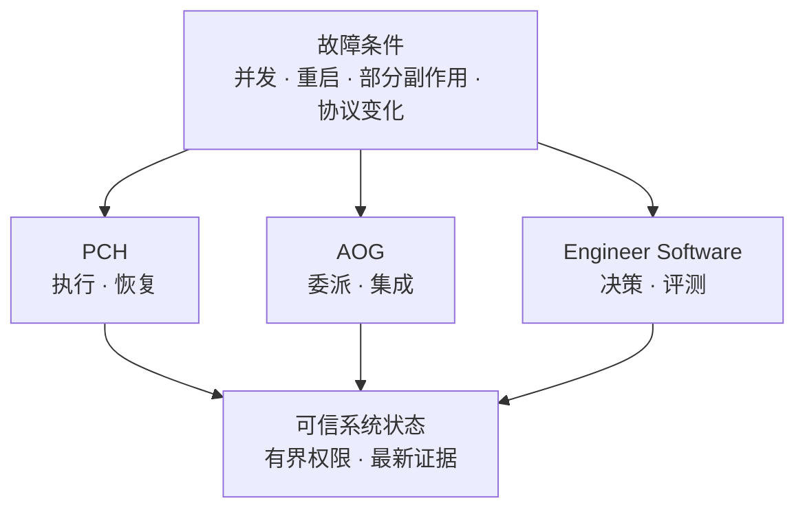

# KirschQAQ

**中国科学技术大学研究生，构建 AI Coding Agent 的执行与控制基础设施。**

Prompt 决定 Agent 试图做什么；运行时基础设施决定系统在并发 worker、进程重启、部分副作用或协议变化
之后还能信任什么。我通过自己的系统和 Pi、Codex、MCP/A2A、OpenHands、Microsoft Agent Framework、
LiteLLM 等上游工程实践，持续验证这一层的设计原则。

> 设计原则：Agent 输出只是候选方案；持久状态、明确的权限边界和最新验证，才使结果成为系统事实。

[English](README.md)

## 我构建的系统

### [Pi Coding Harness](https://github.com/KirschBluteX/pi-coding-harness)

**Pi Coding Agent 的事务与恢复层。**

我为 PCH 设定了一条严格边界：模型负责提出动作，runtime 独占将结果写成持久事实的权限。轻量、被动的
TypeScript Bridge 通过经过认证的有界 RPC 与按需启动的 Host 通信；SQLite WAL、不可变事件链与
content-addressed storage 跨重启保存 Goal -> Route -> WorkCell -> Operation -> Evidence 生命周期。

Single 模式直接在 canonical workspace 中执行；Multi 模式则把不同角色的 worker 放入排除凭据的受限
mirror，并将每个绑定内容哈希的 PatchSet 视为不可信提案。任何 canonical mutation 都必须通过 lease、
fencing token、preimage、postimage 与重新执行的验证器，再由带事务日志的串行集成流程落地。发生中断后，
恢复逻辑会先核对状态未知的副作用，再授权唯一的下一动作。

**核心机制：** TypeScript · authenticated HMAC RPC · SQLite WAL · immutable events · CAS ·
lease/fencing · fault injection

[架构](https://github.com/KirschBluteX/pi-coding-harness/blob/main/docs/ARCHITECTURE.md) ·
[验证证据](https://github.com/KirschBluteX/pi-coding-harness/actions/runs/31951570773)

### [Agent Orchestration Gateway](https://github.com/KirschBluteX/agent-orchestration-gateway)

**Codex 原生 Agents 的确定性准入、调度与集成控制平面。**

AOG 用 schema 校验封闭的 delegation DAG，再将其编译为当前 Host 确实具备能力执行的路线。Codex Hooks
把每次 prepared dispatch 与持久 wave、lifecycle、receipt 状态绑定，覆盖 spawn、reuse、retry、restart
与 completion；guarded plan 会获得独立路由的最终 reviewer。

只有写入 scope 两两不相交的 cooperative writer 才会被准入。它们在受管 Git worktree 或有界 workspace
copy 中执行，随后进入带 staged backup、冲突检查和显式 rollback 的日志化集成路径。这些控制包裹在
Codex 原生 Agents 周围，不再引入第二套 Agent runtime。

**核心机制：** Python · Codex Hooks · typed delegation DAG · capability-aware routing · Git
worktree · durable receipt · journaled rollback

[Benchmark 协议](https://github.com/KirschBluteX/agent-orchestration-gateway/blob/main/docs/BENCHMARK.md)

### [Engineer Software](https://github.com/KirschBluteX/engineer-software)

**面向 AI Coding Agent 的 runtime-neutral 工程决策层。**

Engineer Software 只维护一份 canonical workflow source：它既作为 Codex plugin 暴露，也被投影为
DeepSeek Harness 的 filesystem skill contract。projection、loader、resource 与 source-identity validator
让跨 runtime drift 直接触发失败，而不是悄悄退化成文档同步问题。

确定性 router 会按证据状态选择一个工程模式，而不是迫使所有任务经过固定流水线；routing fixture 覆盖
activation、bypass 与合法 transition。成对行为评测在条件匹配的 worktree 中运行 baseline 与 treatment，
保留原始 event 和 patch，并报告 rubric score、耗时与精确符号检验，不把小规模 pilot 包装成通用性能
结论。

**核心机制：** Python · Codex plugin · DeepSeek Harness skill · generated projection ·
deterministic routing · paired behavior evaluation

[评测设计](https://github.com/KirschBluteX/engineer-software/blob/main/evals/README.md) ·
[Runtime 兼容性](https://github.com/KirschBluteX/engineer-software/blob/main/docs/compatibility.md)

## 精选上游工程实践

### 已被上游接受

- **[MudBlazor #13622](https://github.com/MudBlazor/MudBlazor/pull/13622)** 保持空表分页索引的
  非负不变量，并补充回归覆盖。**已合并。**

### 正在审查的深度实现

**[Microsoft Agent Framework #7679](https://github.com/microsoft/agent-framework/pull/7679) -
确定性并行 `Foreach`。** 该实现为声明式 .NET 工作流增加 opt-in、有界 fan-out，同时保持默认串行行为。
每次迭代在隔离子工作流中运行，缓冲 state 与 event，并按 source index 顺序提交；失败或超时会取消 peer
并丢弃缓冲提交。两个 target framework 分别通过 40 项并行专项测试，完整 915 项单元测试同时通过
`net10.0` 与 `net472`。

**[LiteLLM #37027](https://github.com/BerriAI/litellm/pull/37027) - 为可能触发 OOM 的管理 API
建立查询边界。** 我将问题追踪到 legacy spend-log 各查询分支的无界历史读取。修改为所有路径增加稳定的
`take`/`skip` 顺序，在查询前拒绝非法分页参数，同时保持 legacy list 与 summary contract，并显式暴露
deprecation 和 pagination。映射 endpoint 测试通过 188 项，当前 GitHub check suite 全部为绿色。

**[MCP C# SDK #1816](https://github.com/modelcontextprotocol/csharp-sdk/pull/1816) - 在协议演进中避免
共享状态泄漏。** 统一 typed response-emission boundary 会为 legacy client 移除不支持字段，为当前 client
补充默认值，并编辑新鲜序列化 node，避免共享 result instance 在不同协议版本间泄漏状态；并发兼容告警
同时完成去重。已验证的非 Docker 范围覆盖 2,366 项 core 与 617 项 ASP.NET Core 测试。

<strong>更多上游工程实践</strong>

- **MCP C# SDK：** [task-backed tool 组合 #1814](https://github.com/modelcontextprotocol/csharp-sdk/pull/1814)
  与 [MCP Apps helper 组合 #1815](https://github.com/modelcontextprotocol/csharp-sdk/pull/1815)。
- **A2A SDK：** [Go subscriber backpressure #414](https://github.com/a2aproject/a2a-go/pull/414)、
  [JavaScript wire-version 传播 #659](https://github.com/a2aproject/a2a-js/pull/659)，以及
  [Python active-task snapshot 一致性 #1189](https://github.com/a2aproject/a2a-python/pull/1189)。
- **OpenHands：** [Windows browser discovery #4502](https://github.com/OpenHands/software-agent-sdk/pull/4502)、
  [background delegation lifecycle #4503](https://github.com/OpenHands/software-agent-sdk/pull/4503)，以及
  [automation preflight validation #16614](https://github.com/OpenHands/OpenHands/pull/16614)。
- [查看全部已提交 PR](https://github.com/pulls?q=is%3Apr+author%3AKirschBluteX)

## 设计与评测

- **Runtime authority：**
  [PCH 架构](https://github.com/KirschBluteX/pi-coding-harness/blob/main/docs/ARCHITECTURE.md)
  记录进程所有权、持久状态、mutation authority、恢复优先级与串行集成边界。
- **编排实验：**
  [AOG benchmark 协议](https://github.com/KirschBluteX/agent-orchestration-gateway/blob/main/docs/BENCHMARK.md)
  固定 FeatureBench revision、任务与验收 hash、成对执行 arm、按路线拆分的 usage accounting，并对不完整
  study 采取 fail-closed 处理。
- **工作流评测：**
  [Engineer Software evaluation suite](https://github.com/KirschBluteX/engineer-software/blob/main/evals/README.md)
  将确定性 routing contract 与 matched-worktree behavior comparison 结合，并保留原始 event、patch、耗时、
  exclusion 与 scoring boundary。

## 我如何验证

当单元测试边界小于真实故障边界时，我会直接验证真实集成路径。在
[OpenHands browser discovery #4502](https://github.com/OpenHands/software-agent-sdk/pull/4502) 中，我将
selection-order 专项回归、较完整的 browser-tool suite、4 项 real-browser E2E 与隔离 Windows smoke 结合，
验证实际选中的 executable、CDP 连接、DOM state、screenshot capture 与 process cleanup。

我关注那些正确性取决于并发、恢复、生命周期、协议或评测边界的研究型开源协作。
